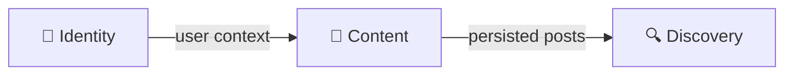

# NexusMedia — Project Guidelines

> **Project Status:** Backend MVP Completed

## 1. Overview

**NexusMedia** is a social network focused on **image upload and discovery**. The MVP delivers three fundamental capabilities:

1. **User Identity** (registration/login via JWT).
2. **Content Creation** (image upload via presigned URLs and post publishing).
3. **Discovery** (public image feed with cursor-based pagination).

### 1.1 Tech Stack

| Layer | Technology |
|---|---|
| Runtime | Next.js (App Router / Route Handlers) |
| API | Apollo Server (GraphQL) |
| ORM | Prisma (`pg` adapter) |
| Database | PostgreSQL |
| Validation | Zod |
| Object Storage | MinIO / S3 Compatible |
| Authentication | JWT (stateless) + bcryptjs |
| IDs | CUID2 (`@paralleldrive/cuid2`) |
| Typing | GraphQL Codegen |

---

## 2. System Architecture

The system is split into **three business modules**. Each module follows a **Clean Architecture** style structure with four technical layers:



### 2.1 Technical Layers (per Module)

```
src/modules/<module>/
├── domain/              # Entities, Value Objects, Interfaces, Domain Errors
├── application/         # Use Cases, DTOs (Zod schema validation)
├── infra/               # Implementations (Prisma Repos, S3 Providers)
└── presentation/        # GraphQL formatters, types, and resolvers
```

### 2.2 Dependency Rules

- **`domain`** is pure business logic. It does not import from other layers. Exceptions are allowed only for base abstractions like `AppError`.
- **`application`** handles the execution flow and validation via DTOs.
- **`infra`** connects the domain interfaces to actual services (PostgreSQL, S3).
- **`presentation`** serves as the composition root, wiring up repositories and use cases.
- **Cross-module:** Modules should be fundamentally isolated. Communication happens via the database (e.g., Discovery queries the `Post` table) or Shared layer patterns (e.g., shared S3 client connection), not by deep imports between modules.

---

## 3. Key Project Conventions

1. **Validation at Boundaries:** Zod schemas are used in the application layer for DTOs. Value Objects handle narrow domain rule validation.
2. **Query Optimization in Read-Paths:** The Discovery module uses simplified Read Models (like `FeedItem`) instead of hydrating complete domain entities, prioritizing read speed.
3. **Cursor-Based Pagination:** All infinite feeds strictly use keyset pagination with an opaque encoded cursor.
4. **Prisma as Central State:** `prisma/schema.prisma` is the source of truth for the database schema, utilizing compound indexes for fast read queries.
5. **Barrel Exports:** Every functional folder exposes its contents via `index.ts` to keep import statements clean and centralized.
6. **Graceful Error Handling:** Domain throws extend `AppError`. The Apollo Server catches these and presents descriptive error messages to clients without leaking stack traces.
