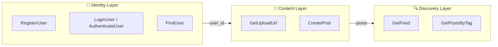
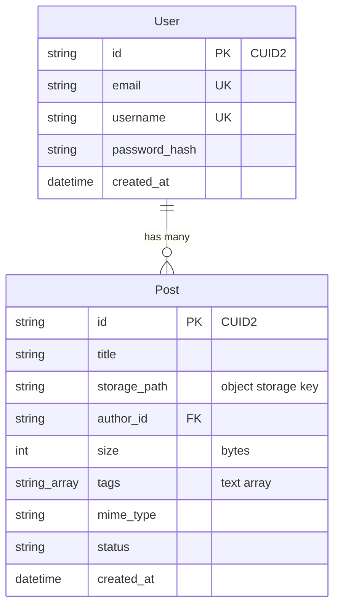
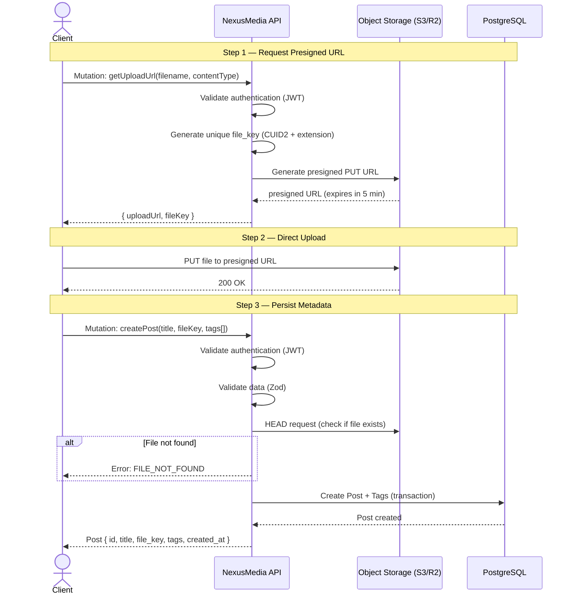
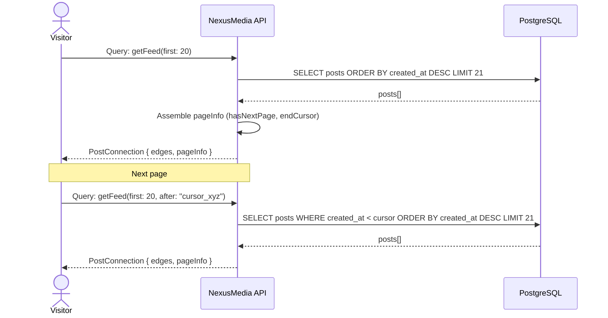

# NexusMedia — Project Guidelines

> **Version:** 1.1 · **Date:** 2026-02-21 · **Project Status:** MVP in development

---

## 1. Overview

**NexusMedia** is a social network focused on **image upload and discovery**. The MVP delivers three fundamental capabilities:

1. **User registration and authentication** (email/username + password).
2. **Image upload** with title and optional tags.
3. **Public image feed** with tag discovery.

### 1.1 Tech Stack

| Layer | Technology |
|---|---|
| Runtime/Framework | Next.js 16 (App Router) |
| API | Apollo Server (GraphQL) via Route Handler |
| ORM/Query Builder | Prisma (`pg` adapter) |
| Database | PostgreSQL |
| Validation | Zod |
| Authentication | JWT (stateless) + bcryptjs |
| IDs | CUID2 (`@paralleldrive/cuid2`) |
| Object Storage | AWS S3 or Cloudflare R2 (via Presigned URLs) |
| Linting/Formatting | Biome |
| GraphQL Typing | GraphQL Codegen |

---

## 2. System Architecture

The system is divided into **three business layers (modules)**, each following internally the **Clean Architecture** in four technical layers.

### 2.1 Business Modules



| Module | Status | Responsibility |
|---|---|---|
| **Identity** | ✅ Validated | Registration, login, authenticated user context |
| **Content** | 🔲 To implement | Image upload (presigned URL), post creation |
| **Discovery** | 🔲 To implement | Public feed, tag search, cursor-based pagination |

### 2.2 Technical Layers (per Module)

Each module follows the structure already established by the Identity module:

```
src/modules/<module>/
├── domain/              # Entities, Value Objects, Factories, Repository Interfaces, Errors
│   ├── entities/
│   ├── value-objects/
│   ├── factories/       # Entity creation + VO validation boundary
│   ├── interfaces/
│   └── errors.ts
├── application/         # Use Cases, DTOs (with Zod schemas), Mappers
│   ├── useCases/
│   ├── dtos/
│   └── mappers/
├── infra/               # Concrete implementations (Prisma Repos, S3 Providers, etc.)
│   ├── repositories/
│   └── providers/
└── presentation/        # GraphQL typeDefs + Resolvers (Composition Root)
    └── graphql/
        ├── types.ts
        └── resolvers.ts
```

### 2.3 Dependency Rules

```
presentation → application → domain
                    ↑
                  infra (implements domain interfaces)
```

- **`domain`** does not import anything from other layers. The only exception is `@/shared/errors/AppError` for the error base class and `@/shared/idGenerator` is **not** used in domain — ID generation is the caller's responsibility.
- **`application`** depends only on `domain` (interfaces, factories, entities).
- **`infra`** implements the interfaces defined in `domain`. Repositories use `Factory.restore()` to rehydrate entities.
- **`presentation`** acts as the **Composition Root**: instantiates concrete repositories and providers, injects them into Use Cases.

> [!IMPORTANT]
> No module should import directly from another module. Communication between modules happens exclusively through the database (Foreign Keys) or the `shared/` layer.

### 2.5 Value Object & Factory Conventions

**Entities store primitives** (strings, numbers, dates) — not Value Object instances. This is critical because the system is **query-heavy**: reconstructing entities from the database must have zero validation overhead.

**Value Objects validate at the mutation boundary only:**
- `Factory.create()` instantiates VOs (`Email.create()`, `Username.create()`) to validate, then stores `.value` (the primitive) in the entity.
- `Factory.restore()` bypasses all validation — data from the DB is already trusted.

**Value Object structure convention:**
```typescript
export class Email {
  private readonly _value: string;
  private constructor(email: string) { this._value = email; }

  static create(value: string): Email { /* validate + throw AppError */ }
  static validate(value: string): boolean { /* pure check */ }
  get value(): string { return this._value; }
}
```

**Factory receives the ID as a parameter** — it does not generate IDs. The Use Case is responsible for generating the ID (`generateUserId()`) and passing it to the factory. This keeps the factory a pure domain concern with no infrastructure dependencies.

```typescript
// Use Case generates ID and delegates to Factory
const id = generateUserId();
const user = UserFactory.create({ email, username, password_hash }, id);
```

### 2.4 Shared Layer (`src/shared/`)

```
src/shared/
├── errors/
│   └── AppError.ts         # Abstract base class for domain errors
├── infra/
│   ├── prisma.ts           # PrismaClient singleton instance
│   └── providers.ts        # Provider singletons (hash, token)
├── graphQlContext.ts        # Authentication context interface
├── idGenerator.ts           # ID generation (CUID2)
└── index.ts                 # Barrel exports
```

---

## 3. Data Schema

### 3.1 ER Diagram



### 3.2 Prisma Schema

```prisma
model User {
  id            String   @id @unique
  email         String   @unique
  username      String   @unique
  password_hash String
  created_at    DateTime @default(now())

  posts Post[]
}

model Post {
  id           String   @id @unique
  title        String
  storage_path String
  author_id    String
  size         Int
  tags         String[]
  mime_type    String
  status       String   @default("PUBLISHED")
  created_at   DateTime @default(now())

  author User @relation(fields: [author_id], references: [id])

  @@index([created_at(sort: Desc)])
  @@index([author_id])
}
```

Tags are stored as a **PostgreSQL text array** directly on the Post row. No separate `Tag` table or pivot table.

### 3.3 Indexes

| Table | Index | Type | Rationale |
|---|---|---|---|
| `Post` | `created_at` | B-Tree (DESC) | Cursor-based pagination in the feed |
| `Post` | `author_id` | B-Tree | Query of posts by author |

> [!NOTE]
> PostgreSQL supports GIN indexes on array columns. If tag-based queries become a performance bottleneck, a GIN index on `Post.tags` can be added later.

---

## 4. Content Layer — Detailed Design

### 4.1 Upload Flow (3 Steps)



### 4.2 Business Rules

1. **Authentication required** for `getUploadUrl` and `createPost`.
2. `file_key` is generated by the server (never by the client) to prevent conflicts and path traversal.
3. Presigned URL should expire in **5 minutes** (design inference).
4. Before persisting the post, the API **must verify** if the file actually exists in object storage with a HEAD call.
5. If the HEAD fails or the file does not exist, the post **is not created** (graceful degradation).
6. Tags are normalized to lowercase and fetched/created via `findOrCreate` to avoid duplicates.
7. Post + Tags creation must be **atomic** (database transaction).

### 4.3 Domain Entities

#### `Post`

```typescript
interface PostProps {
  title: string;
  storage_path: string;
  author_id: string;
  size: number;
  tags: string[];
  mime_type: string;
  status: "PUBLISHED";
  created_at?: Date;
}
```

**Value Objects (validated in Factory):** `Title` (1–120 chars), `MimeType` (allowlist), `TagName` (lowercase, 1–30 chars, alphanumeric + hyphens).

### 4.4 Repository Interfaces

```typescript
interface IPostRepository {
  save(post: Post): Promise<Post>;
  findById(id: string): Promise<Post | null>;
}
```

### 4.5 Storage Provider Interface

```typescript
// IStorageProvider (in domain/interfaces/)
interface IStorageProvider {
  generatePresignedUploadUrl(
    fileKey: string,
    contentType: string,
  ): Promise<string>;

  fileExists(fileKey: string): Promise<boolean>;

  getPublicUrl(fileKey: string): string;
}
```

> [!NOTE]
> **Design Inference:** The `IStorageProvider` interface is a proposed abstraction to decouple business logic from the concrete provider (S3, R2, MinIO, etc.). The concrete implementation will reside in `infra/providers/`.

### 4.6 GraphQL Contracts — Content

```graphql
# --- Types ---
type Post {
  id: ID!
  title: String!
  imageUrl: String!       # Public URL built from file_key
  tags: [Tag!]!
  author: User!
  created_at: String!
}

type Tag {
  id: ID!
  name: String!
}

type UploadPayload {
  uploadUrl: String!      # Presigned URL for PUT
  fileKey: String!        # Key to use in createPost
}

# --- Inputs ---
input GetUploadUrlInput {
  filename: String!       # Original name to extract extension
  contentType: String!    # MIME type (image/jpeg, image/png, etc.)
}

input CreatePostInput {
  title: String!
  fileKey: String!        # Key returned by getUploadUrl
  tags: [String!]         # Tag names (optional)
}

# --- Operations ---
extend type Mutation {
  getUploadUrl(input: GetUploadUrlInput!): UploadPayload!   # Auth required
  createPost(input: CreatePostInput!): Post!                 # Auth required
}
```

---

## 5. Discovery Layer — Detailed Design

### 5.1 Public Feed Flow



### 5.2 Cursor-Based Pagination

Pagination is mandatory **cursor-based** (not offset-based), following the [Relay Connection](https://relay.dev/graphql/connections.htm) specification.

**Cursor Strategy:** The cursor is the `created_at` of the last item on the page, Base64 encoded.

```typescript
// Encode
const cursor = Buffer.from(post.created_at.toISOString()).toString("base64");

// Decode
const created_at = new Date(Buffer.from(cursor, "base64").toString("utf-8"));
```

**Resulting SQL Logic:**
```sql
SELECT p.*, array_agg(t.name) as tags
FROM post p
LEFT JOIN post_tags pt ON pt.post_id = p.id
LEFT JOIN tag t ON t.id = pt.tag_id
WHERE p.created_at < :cursor     -- omitted on first page
GROUP BY p.id
ORDER BY p.created_at DESC
LIMIT :first + 1                 -- +1 to detect hasNextPage
```

> [!IMPORTANT]
> Fetching `first + 1` results allows determining `hasNextPage` without a separate COUNT query. If `first + 1` items are returned, `hasNextPage = true` and the last item is discarded from the response.

### 5.3 Strategy for < 200ms Latency

To reach the non-functional requirement of < 200ms latency in the feed:

| Strategy | Detail |
|---|---|
| **B-Tree DESC Index** on `Post.created_at` | The feed query is a range scan on the index, avoiding runtime sorting |
| **Cursor-based pagination** | Eliminates offset scan (which degrades with depth) |
| **Fixed Item Limit** | `first` limited to a maximum of 50 items per page |
| **Avoid N+1** | Use Prisma `include` or explicit join for tags and author |
| **Connection Pooling** | PrismaClient with `pg` Pool already configured in `shared/infra/prisma.ts` |

> [!NOTE]
> **Design Inference:** If latency becomes an issue even with indexes, consider introducing a cache layer (Redis) for the public feed, as its data does not need to be strictly real-time.

### 5.4 Entities and Interfaces

```typescript
// Feed is a collection, not a persisted entity.
// The result is a PostConnection (Relay pattern).

interface IFeedRepository {
  getFeed(params: {
    first: number;
    after?: string; // cursor (encoded created_at)
  }): Promise<{ posts: Post[]; hasNextPage: boolean }>;

  getPostsByTag(params: {
    tagName: string;
    first: number;
    after?: string;
  }): Promise<{ posts: Post[]; hasNextPage: boolean }>;
}
```

### 5.5 GraphQL Contracts — Discovery

```graphql
# --- Relay Connection Types ---
type PostEdge {
  cursor: String!
  node: Post!
}

type PageInfo {
  hasNextPage: Boolean!
  endCursor: String
}

type PostConnection {
  edges: [PostEdge!]!
  pageInfo: PageInfo!
}

# --- Operations ---
extend type Query {
  feed(first: Int!, after: String): PostConnection!
  postsByTag(tag: String!, first: Int!, after: String): PostConnection!
}
```

### 5.6 Access Rule

- **`feed`** and **`postsByTag`** are **public queries** — authentication not required.
- Any site visitor can access the feed.

---

## 6. Error Handling and Graceful Degradation

### 6.1 Error Hierarchy

All domain errors extend `AppError` (already implemented in `shared/errors/`):

```
AppError (abstract)
├── InvalidCredentialsError      # Identity — wrong email/password combo
├── InvalidEmailError            # Identity — VO validation
├── InvalidPasswordError         # Identity — VO validation
├── InvalidUsernameError         # Identity — VO validation
├── UnauthorizedError            # Identity — missing/invalid JWT
├── UserAlreadyExistsError       # Identity — duplicate email/username
├── InvalidTitleError            # Content — VO validation
├── InvalidMimeTypeError         # Content — VO validation
├── InvalidTagNameError          # Content — VO validation
├── PostNotFoundError            # Discovery
└── InvalidCursorError           # Discovery — malformed cursor
```

### 6.2 Graceful Degradation Flow

The Apollo Server error pipeline (already configured in `route.ts`) ensures:

1. **`AppError`** → returns custom `message` + `code` to the client.
2. **`ZodError`** → returns `BAD_USER_INPUT` with field-level details.
3. **Generic Error** → returns `INTERNAL_SERVER_ERROR` without leaking details.

**Critical Business Rule:** If any upload step fails, **nothing is persisted**:
- If presigned URL generation fails → error returned, no data saved.
- If S3 upload fails → only the client is impacted. No post exists.
- If `createPost` fails (HEAD check or transaction) → post is not created, no orphaned data in the DB.

> [!WARNING]
> Orphaned files in object storage (upload done but `createPost` never called) are unavoidable. It is recommended to configure a **lifecycle policy** on the bucket to expire objects without an associated post after 24h. This is out of MVP scope but should be implemented before go-live.

---

## 7. Module Integration in the API

### 7.1 Schema and Resolver Registration

The GraphQL route (`src/app/api/graphql/route.ts`) must consolidate typeDefs and resolvers from all modules:

```typescript
import { ApolloServer } from "@apollo/server";
// Identity
import { identityTypeDefs, identityResolvers } from "@/modules/identity/presentation/graphql";
// Content
import { contentTypeDefs, contentResolvers } from "@/modules/content/presentation/graphql";
// Discovery
import { discoveryTypeDefs, discoveryResolvers } from "@/modules/discovery/presentation/graphql";

const server = new ApolloServer({
  typeDefs: [identityTypeDefs, contentTypeDefs, discoveryTypeDefs],
  resolvers: [identityResolvers, contentResolvers, discoveryResolvers],
  // ... existing formatError
});
```

### 7.2 Updated Codegen

`codegen.ts` must point to schemas from all modules:

```typescript
const config: CodegenConfig = {
  overwrite: true,
  schema: [
    "src/modules/identity/presentation/graphql/types.ts",
    "src/modules/content/presentation/graphql/types.ts",
    "src/modules/discovery/presentation/graphql/types.ts",
  ],
  generates: {
    "src/generated/graphql.ts": {
      plugins: ["typescript", "typescript-resolvers"],
    },
  },
};
```

---

## 8. Non-Functional Requirements — Strategy Summary

| Requirement | Strategy |
|---|---|
| **Isolated Storage** | Images in S3/R2 via presigned URLs; only `file_key` in the DB |
| **Feed Latency < 200ms** | DESC index on `created_at`, cursor-based pagination, avoid N+1, 50-item max limit |
| **Graceful degradation** | pre-persistence HEAD check, atomic transactions, `AppError` hierarchy, Apollo `formatError` |
| **Stateless Auth** | JWT in `Authorization: Bearer <token>` header, context extracted in Apollo middleware |

---

## 9. Implementation Roadmap

### Phase 1 — Content Layer
1. Expand Prisma schema with `Post`, `Tag`, and `PostTag` models.
2. Implement domain entities (`Post`, `Tag`) and value objects.
3. Implement `IStorageProvider` and the concrete S3/R2 implementation.
4. Implement `IPostRepository` and `ITagRepository` with Prisma.
5. Implement use cases: `GetUploadUrl`, `CreatePost`.
6. Create GraphQL typeDefs and resolvers.
7. Integrate into `route.ts` and update codegen.

### Phase 2 — Discovery Layer
1. Implement `IFeedRepository` with cursor-based pagination.
2. Implement use cases: `GetFeed`, `GetPostsByTag`.
3. Create GraphQL typeDefs and resolvers (public queries).
4. Add indexes to the Prisma schema.
5. Integrate into `route.ts` and update codegen.

### Phase 3 — Frontend
1. Upload page (form + 3-step flow).
2. Public feed page (image grid + infinite scroll).
3. Search/filter by tags.

### Phase 4 — Hardening
1. Lifecycle policy in the bucket for cleaning orphaned files.
2. Rate limiting on upload mutations.
3. Supported MIME types validation (image/jpeg, image/png, image/webp, image/gif).
4. End-to-end integration tests.

---

## 10. Project Conventions

| Aspect | Convention |
|---|---|
| **IDs** | CUID2 (`@paralleldrive/cuid2`), generated in the Use Case, passed to Factory |
| **Input Validation** | Zod schemas in `application` layer DTOs |
| **Domain Validation** | Value Objects in `domain/value-objects/`, invoked by Factory |
| **Domain Errors** | Classes extending `AppError` with `message` and `code` |
| **Entity Props** | Primitives only (strings, numbers, dates) — never VO instances |
| **Entity Instantiation** | Via `Factory` in `domain/factories/` (create validates, restore bypasses) |
| **Data Mapping** | Via static `Mapper` (entity → DTO) |
| **Dependency Injection** | Manual via Composition Root in resolvers |
| **Exports** | Barrel files (`index.ts`) in each directory |
| **Filenames** | PascalCase for classes/entities, camelCase for utilities |
| **Linting** | Biome (check + format) |

---

*Document maintained by the architecture team. Last updated: 2026-02-21 (v1.1 — factory moved to domain, VO conventions, error hierarchy update).*
