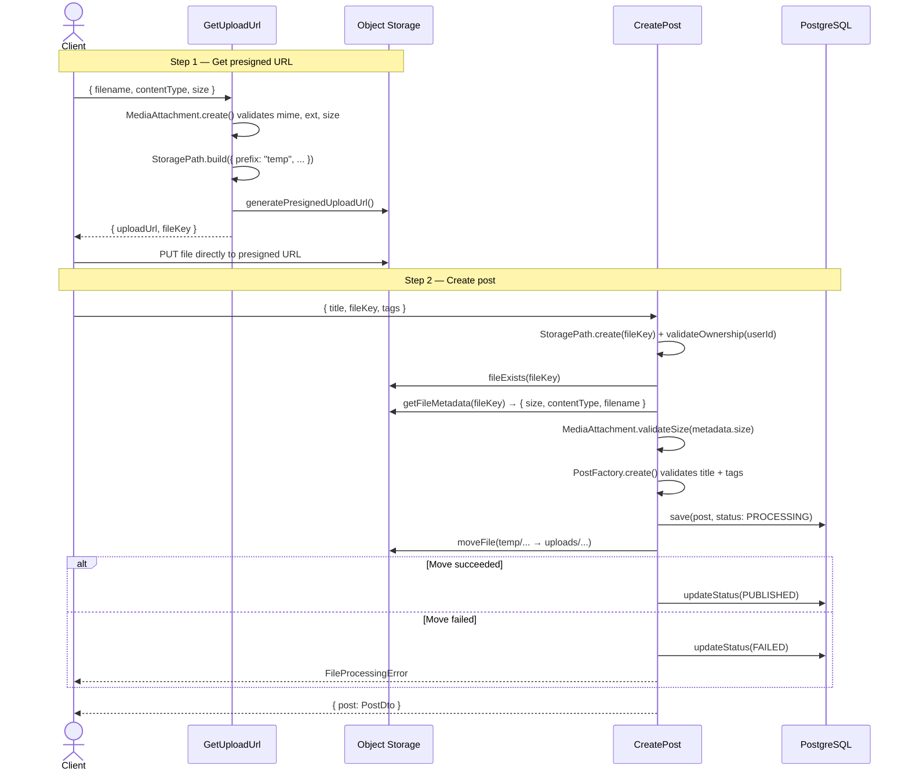
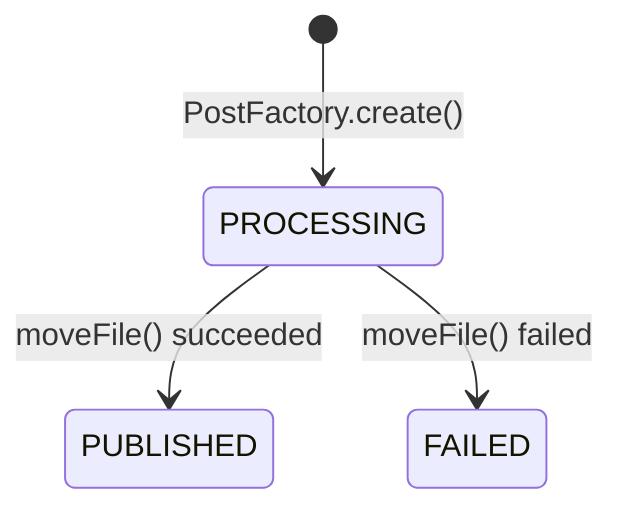

# Content Module

The Content module handles image upload and post creation for NexusMedia. It follows a **two-step upload flow** that separates file storage from post persistence, enabling orphaned file cleanup and consistent state management.

## Architecture Overview

```
content/
├── domain/
│   ├── entities/          Post (entity + PostStatus type)
│   ├── value-objects/     Title, MimeType, TagName, MediaAttachment
│   ├── factories/         PostFactory (create with validation, restore without)
│   ├── interfaces/        IPostRepository, IStorageProvider
│   ├── value-objects/     Title, MimeType, TagName, MediaAttachment, StoragePath
│   └── errors.ts          Domain-specific errors
├── application/
│   ├── useCases/          GetUploadUrl, CreatePost
│   ├── dtos/              Zod schemas + request/response interfaces
│   └── mappers/           PostMapper (entity → PostDto)
└── docs/                  This file
```

## Upload Flow

The upload process is split into two steps to ensure file integrity and enable cleanup of abandoned uploads.



## Storage Path Strategy

Files use a date-partitioned path structure with two prefixes:

| Prefix | Purpose | Lifecycle |
|--------|---------|-----------|
| `temp/` | Presigned upload destination | Cleaned up every 24h by scheduled job |
| `uploads/` | Permanent storage for published posts | Persistent |

**Path format:** `{prefix}/posts/{userId}/{year}/{month}/{day}/{randomId}.{ext}`

The `StoragePath` Value Object (located in `domain/value-objects/`) centralizes all path logic:
- `StoragePath.build()` — constructs new paths (used by GetUploadUrl)
- `StoragePath.create()` — validates existing paths from client input
- `.toPermanent()` — transitions `temp/` → `uploads/`
- `.validateOwnership(userId)` — ensures the userId in the path matches the authenticated user
- `.value` — returns the raw string path

## Original Filename Persistence

To remain storage-agnostic while preserving the original filename:
1. `GetUploadUrl` passes `original-filename` in the storage metadata.
2. `CreatePost` retrieves it via `storageProvider.getFileMetadata()`.
3. The filename is persisted in the `Post` entity's `filename` field.

## Security Layers

| Layer | Mechanism | Error |
|-------|-----------|-------|
| File type | `MediaAttachment.create()` validates mime + extension match | `InvalidMimeTypeError` |
| File size | `MediaAttachment.validateSize()` checks at upload + post creation | `FileTooLargeError` |
| Path format | `StoragePath.create()` enforces `temp/` or `uploads/` prefix | `InvalidStoragePathError` |
| Path ownership | `StoragePath.validateOwnership()` checks userId segment | `UnauthorizedStoragePathError` |
| File existence | `storageProvider.fileExists()` before creating post | `FileNotFoundError` |
| Title / Tags | `PostFactory.create()` via Title and TagName VOs | `InvalidTitleError`, `InvalidTagNameError` |

## Post Status Machine



Posts are saved with `PROCESSING` status **before** the file move. This guarantees:
- If the move **succeeds** but the DB update fails → post stays PROCESSING (recoverable)
- If the move **fails** → post is marked FAILED immediately
- Orphaned files in `temp/` are cleaned by scheduled job regardless

## Orphaned File Cleanup

A periodic job (every 24h) deletes all files under `temp/`. Since:
1. Completed uploads are moved to `uploads/` during CreatePost
2. Abandoned uploads (user got URL but never created a post) remain in `temp/`

This approach avoids the need to track upload state — anything still in `temp/` after 24h is considered abandoned.

## Pending Items

- [ ] UploadToken: replace raw `fileKey` exposure with a signed token to prevent path manipulation
- [ ] Scheduled cleanup job implementation for `temp/` prefix
- [ ] Delete post use case (remove from DB + storage)
- [ ] `IStorageProvider` concrete implementation (S3/R2)
- [ ] `IPostRepository` concrete implementation (Prisma)
